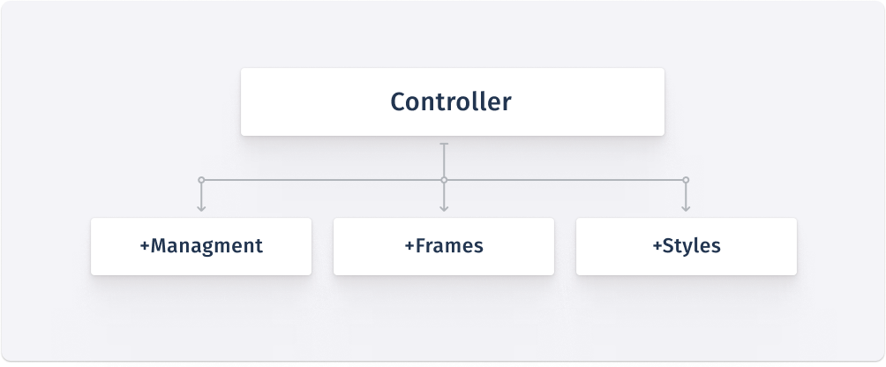
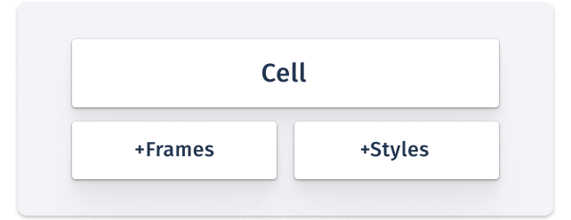
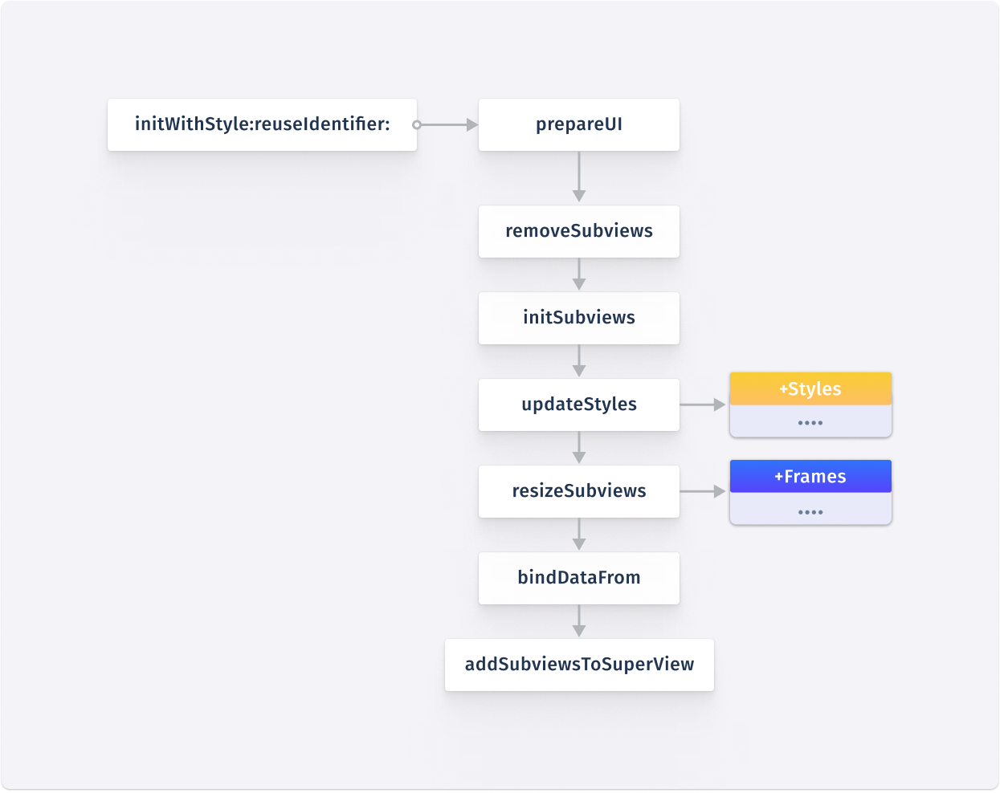
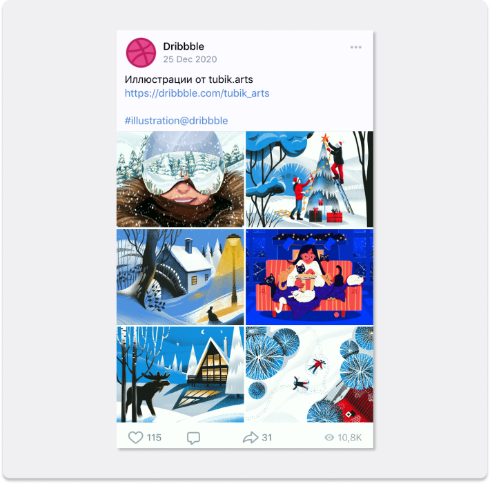
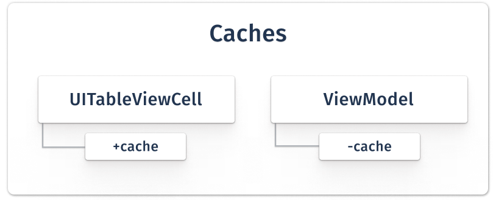
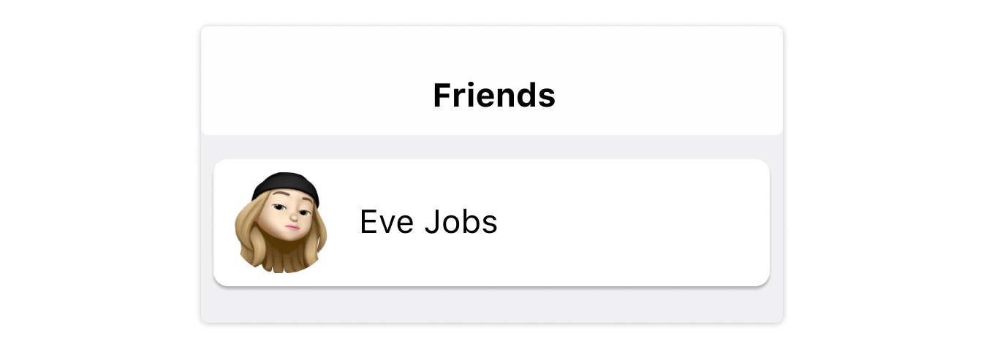
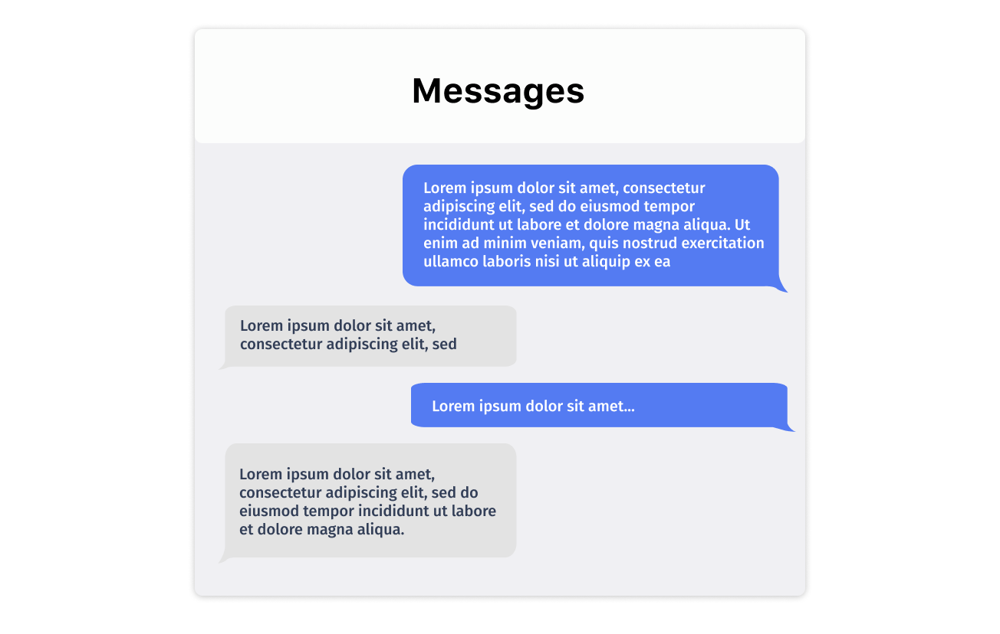
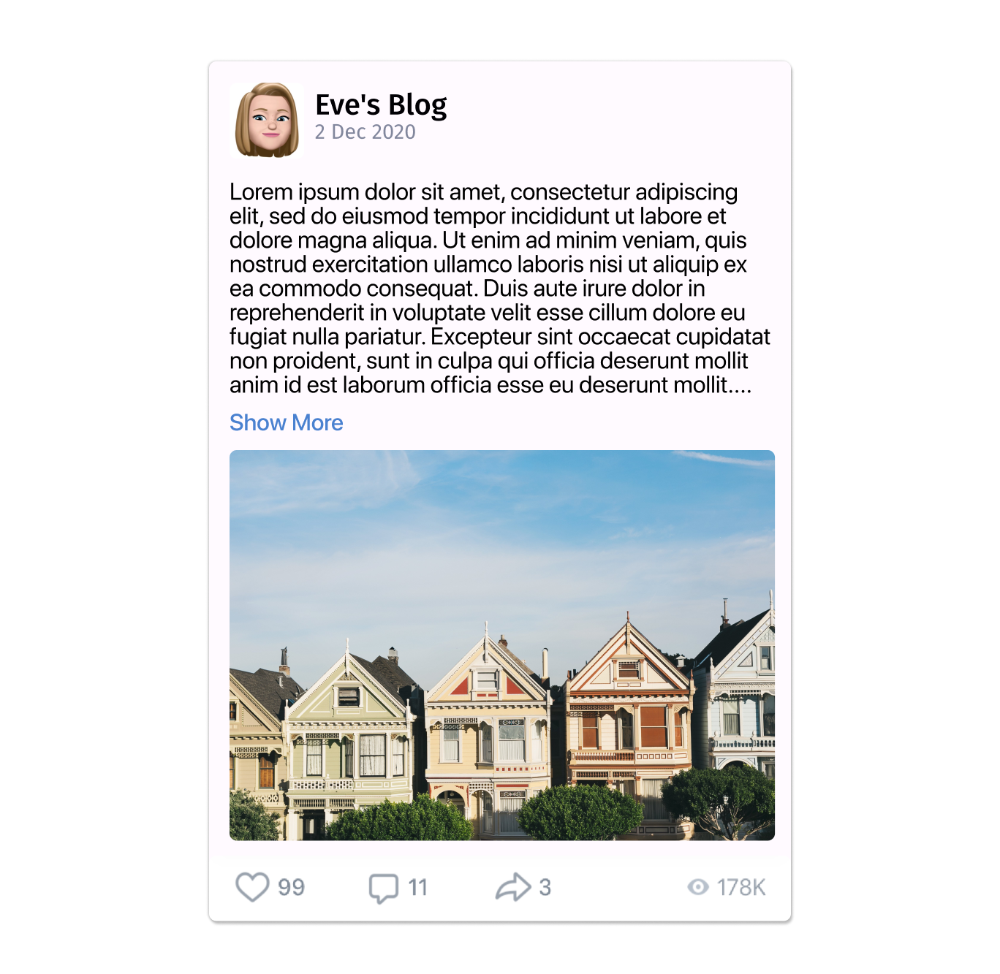
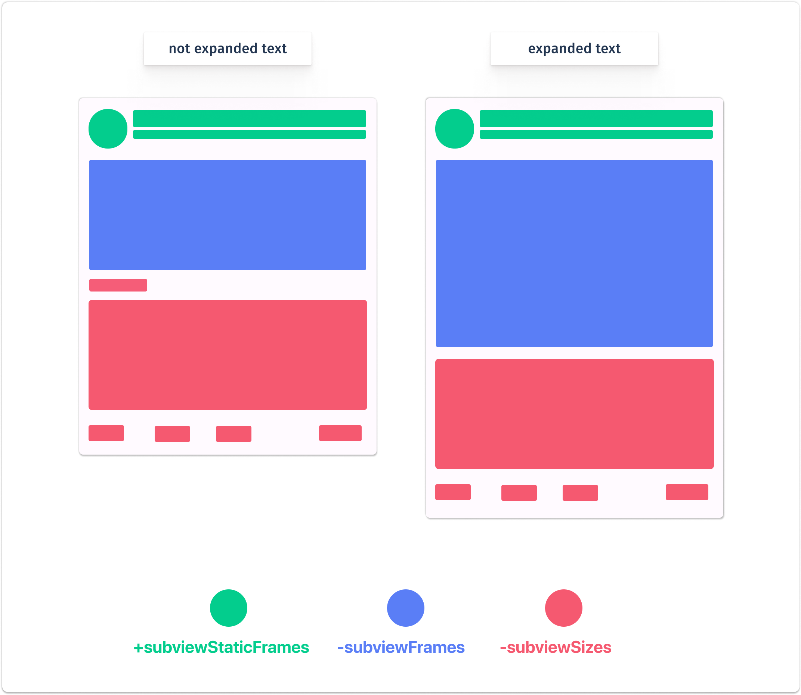
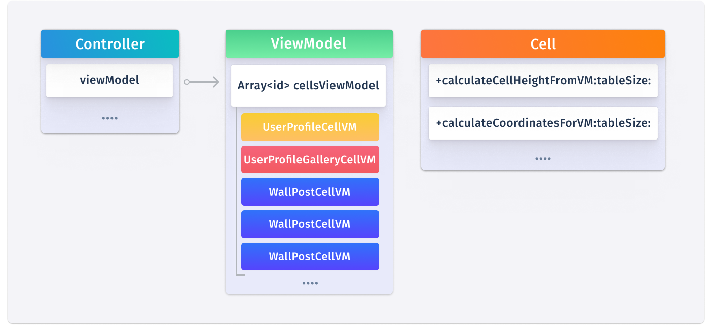

# Паттерн MFS для табличных представлений в iOS приложениях

Все преимущества `MFS` в полной мере раскрываются при работе с ячейками таблицы.<br><br>Цель `MFS`: рационально распределять обязанности между категориями ячейки, чтобы обеспечить  максимальную контролируемость всех процессов и плавность в **60 FPS** при прокрутке таблицы на любых устройствах.

<p align="center">
  
</p>

[Фото: View Controllers for iOS & Swift Explained learnappmaking.com](https://learnappmaking.com/view-controller-uiviewcontroller-ios-swift/)

<br><br>

## Причина создания паттерна

`MFS` был создан потому, что стандартные методы `UITableViewCell`, которые нам предлагают переопределить, не отвечают современным потребностям сложных интерфейсов.<br>

Вопросы следующего характера, перечисленные ниже, по-прежнему оставались не закрытыми: 

1) В каком методе скрывать ненужные `subviews` у переиспользованной ячейки ?

2) В каком методе производить перерасчет размеров и координат ?

3) В каком методе осуществлять вставку контент в `subviews` ячейки ?

В конечном итоге, было принято решение проанализировать опыт работы и систематизировать его на основании приобретенных знаний в готовый паттерн, который можно было бы использовать как шпаргалку при построении новых проектов.
<br>Чтобы более глубоко ознакомиться с причинами и историей создания паттерна, а также узнать, как паттерн функционирует при работе с контроллерами, рекомендуем ознакомиться с [первой частью данной статьи]().

## Деление на категории

Изначально паттерн получил свое название от сокращения названий категорий `Managment`-`Frames`-`Styles`, которые расширяли стандартный класс вью контроллера, возлагая на себя определенные функциональные обязанности.

<p align="center">
  
</p>

При работе с ячейками подобный подход был пересмотрен и код из категории `+Managment` было решено оставить в главном файле имплементации ячейки.<br>Потому что, традиционно, класс ячейки менее нагружен, чем самый простой пример контроллера.<br>

<p align="center">
  
</p>

Однако, если ваша ячейка, к примеру, вынуждена выполнять протоколы `UIScrollViewDelegate`,`UITableViewDataSource`,`UITableViewDelegate` и вы считаете, что главный имплементационный файл и так нагружен, то вы можете смело создать категорию `+Managment` и вынести весь код отвечающий за построения `UI` в нее.<br>

<br>

Предназначение каждой из категорий хорошо описано в таблице ниже:

| Название категории                      | Обязанности                                                                                                                                                                        |
| --------------------------------------- | ---------------------------------------------------------------------------------------------------------------------------------------------------------------------------------- |
| `+Managment`<br/>(*Optional for cells*) | Содержит методы дополнительного жизненного цикла интерфейса, которые инициализируют, добавляют на экран, наполняют контентом и совершают прочие действия.<br/>                     |
| `+Frames`                               | Содержит `pure` функции вычисляющие размеры и координаты `subviews`.                                                                                                               |
| `+Styles`                               | Содержит методы графической конфигурации `subviews`.<br/>Например задает цвет,закругление,шрифт, итд.<br/>Как правило для каждого `property` существует отдельный метод настройки. |

<br>

<br>

## Главные методы и порядок их вызовов

Не секрет, что имея целый набор специальных методов для создания `UI`, в зависимости от функциональных обязанностей, которые стоят перед отдельной ячейкой, порядок их вызовов может несколько отличаться.

<p align="center">
  
</p>

На схеме, расположенной выше, приведен усредненный пример цепочки вызванных методов для построения `UI` ячейки.<br>

Различий, о которых шла речь, может быть множество, мы же перечислим только некоторые из них:

1. Если все ячейки таблицы содержат однотипный контент (например список друзей пользователя), то вызывать каждый раз метод `removeSubviews`, который удаляет все `subviews` с `contentView`, является нецелесообразно.

2. При перевороте таблицы системой вызывается метод `layoutSubviews`, что также порождает ветвление алгоритма в зависимости от ситуации, где-то требуется вызывать только `resizeSubviews`, где-то еще и `bindDataFrom`, а в некоторых случаях требуется полностью перерисовать интерфейс ячейки.
   
   <br>

## Функциональные обязанности главных методов

| Имя метода               | Принимает ли вьюМодель | Предназначение                                                                                                                                                                                                                                                         |
| ------------------------ |:----------------------:| ---------------------------------------------------------------------------------------------------------------------------------------------------------------------------------------------------------------------------------------------------------------------- |
| `prepareUI`              | ❌                      | Главный метод построения `UI`, вызывает нужную последовательность методов.<br/>Данный метод рекомендуется вызывать из `initWithStyle:reuseIdentifier:`.                                                                                                                |
| `removeSubviews`         | ❌                      | Удаляет все `subviews` с `superView`.<br/>А также обнуляет все проперти на `UI` элементы.                                                                                                                                                                              |
| `initSubviews`           | ✅                      | Инициализирует нужные `subviews`.                                                                                                                                                                                                                                      |
| `updateStyles`           | ✅                      | Вызывает индивидуальные методы настройки для каждого `subviews`, куда также передает вьюМодель, на основании данных которой может быть принято решение относительно стилей.<br/>Например, задает разный цвет для плашек сообщений, в зависимости от пола пользователя. |
| `bindDataFrom`           | ✅                      | Вставляет данные из вьюМодели в `subviews`.                                                                                                                                                                                                                            |
| `resizeSubviews`         | ✅                      | Вызывает индивидуальные методы расчета размеров и координат для каждой `subviews`.                                                                                                                                                                                     |
| `addSubviewsToSuperView` | ❌                      | Добавляет `subviews` на `superView` ,если те были проинициализированы и не добавлены на родительское представление ранее.                                                                                                                                              |

<br>
Из выше перечисленных методов явно прослеживается виденье того, как должен строиться UI.

**Порядок действий при первой инициализации ячейки:**

1. Инициализация нужных `subviews`.

2. Обновление стилей `subviews` (цвета/размер шрифта итд).

3. Вставка данных в `subviews`.

4. Расчет и установка корректных `frames` для `subviews`.

5. Добавление полностью готовых `subviews` на родительское представление.

<br>

**Порядок действий при пере-использовании ячейки:**

1. Вызывается сеттер установки вьюМодели `setViewModel`, который вызывает остальные методы по цепочке.

2. Обновляются стили `subviews` 
   (например увеличивается отступ когда пост содержит четырехзначное число лайков)`updateStyles`.

3. Происходит расчет новых`frames` для `subviews` на основании данных новой вьюМодели.

4. Осуществляется биндинг данных.

<br>

**Порядок действий при перевороте таблицы:**

1. Системой вызывается метод `layoutSubviews`.

2. А в переопределенной реализации `layoutSubviews` мы вызываем `resizeSubviews`.

<br>

**⚠️ Еще раз вынужден повторить, порядок и набор вызываемых методов описанных выше, <mark>ЯВЛЯЕТСЯ ОБОБЩЕННЫМ</mark> примером, в зависимости от разной сложности интерфейса, вам придется самостоятельно конфигурировать схему вызовов.**
<br><br>

## Обзор листинга методов

Разбор методов мы будем осуществлять на примере ячейки поста из социальной сети.<br>Обратите внимание, на то, что демо-приложение из примера использует архитектуру **MVVM**.<br>Где:<br>

1. `View` - отвечает исключительно за `UI` пользователя.

2. `ViewModel` - является промежуточным звеном между `view` и `model`.<br>Хранит методы обертки (преобразует данные из модели для отображения во `view`), хранит различные кэшируемые данные (высоту ячейки, `frames` внутренних элементов итд).

3. `Model` - хранит сырые данные.

<p align="center">
  
</p>

Главным камнем преткновения использования таблицы является вопрос пере-использования ячеек.<br>Перед началом работы вы должны решить - ячейки в вашей таблице буду всегда инициализировать один и тот же набор `subviews`, а потом, если это требуется, скрывать их в отдельных ячейках (например кнопку read more... вы можете проинициализировать в каждой ячейки, но в тех ячейках, в которых текст не превышает лимит, эту кнопку вам потребуется скрыть) - или  вы будете каждый раз удалять не нужные `subviews` с `contentView` и инициализировать нужные.<br>От этого решения (о котором подробнее будет написано ниже) будет зависеть порядок вызовов методов рисования.<br><br>

Первым в нашей цепочке идет системный метод инициализации ячейки.<br>В нем мы сразу вызываем метод `prepareUI`, который подготовит весь `UI` ячейки.<br>Помните, что `initWithStyle:reuseIdentifier:` как правило вызывается всего несколько раз за все время использования таблицы, так как ячейки пере-используются.

```objectivec
- (instancetype)initWithStyle:(UITableViewCellStyle)style reuseIdentifier:(nullable NSString *)reuseIdentifier
{
    self = [super initWithStyle:style reuseIdentifier:reuseIdentifier];
    if (self.contentView) {
        [self prepareUI];
    }
    return self;
}
```

Метод создания ячейки всегда вызывается раньше, чем сеттер ее вьюМодели, поэтому, на момент исполнения метода `prepareUI` ее вьюМодел равняется `nil`.<br>
Следовательно, у вас имеется всего два пути:

1. Вызывать `prepareUI` из `initWithStyle:reuseIdentifier:`.<br>Так можно делать если каждая ячейка содержит один и тот же ограниченный набор `subviews`.<br>Если же ячейки все-таки имеют некую вариативность, например в посте может отсутствовать либо присутствовать фото, тогда рекомендуется не удалять каждый раз `subviews`, а просто в методе `bindDataFrom` скрывать ненужные элементы.

2. Вызывать `prepareUI` из `setViewModel`.<br>Так нужно делать, если содержимое ячейки очень вариативное и содержать общий набор проинициализированных `subviews` вы просто не можете.

```objectivec
/*--------------------------------------------------------------------------------------------------------------
  Основной метод построения интерфейса. Вызывает нужную последовательность методов
 --------------------------------------------------------------------------------------------------------------*/
- (void) prepareUI
{
    if (self.contentView){
        [self initSubviews:self.viewModel];
        [self updateStyles:self.viewModel];
        [self resizeSubviews:self.viewModel];
        [self bindDataFrom:self.viewModel];
        [self addSubviewsToSuperView];
    }
}
```

Обратите внимание, что в этом методе происходит чистая инициализация, без каких-
либо настроек. <br>Также алгоритм имеет встроенную защиту от повторной инициализации `subviews`.

```objectivec
/*--------------------------------------------------------------------------------------------------------------
 Инициализирует нужные subviews на основе данных из viewModel
 --------------------------------------------------------------------------------------------------------------*/
- (void) initSubviews:(WallPostCellVM*)viewModel
{
    if (self.contentView)
    {
        if (!self.avatarImgView) self.avatarImgView  = [[UIImageView alloc] init];
        if (!self.ownerNameLbl)  self.ownerNameLbl   = [[UILabel alloc] init];
        if (!self.postDateLbl)   self.postDateLbl    = [[UILabel alloc] init];
        if (!self.textLbl)       self.textLbl        = [[UILabel alloc] init];
        if (!self.likeBtn)       self.likeBtn        = [UIButton buttonWithType:UIButtonTypeCustom];
         ....
    }
}
```

В данном методе мы вызываем функции определенные в категории `+Styles`.<br>Они настраивают цвет, шрифт, иконки, селекторы и т.д. для `subviews`.<br>Обратите внимание на использование некого проперти `isStylized`.<br>Данное проперти динамически добавлено в класс `UIView` соответствующей категорией.<br>Дело в том, что некоторые `subview` имеет смысл конфигурировать всего один раз, ввиду крайней трудоемкости этого процесса, а `isStylized` используется как флаг, который оповещает алгоритм, о том, что данное проперти уже настроено.

```objectivec
/*--------------------------------------------------------------------------------------------------------------
 Вызывает методы графической конфигурации каждого subview
 --------------------------------------------------------------------------------------------------------------*/
- (void) updateStyles:(WallPostCellVM*)viewModel
{
    if (!viewModel) return;
    if (self.avatarImgView) [self styleFor_avatarImgView:self.avatarImgView vm:viewModel];
    if (self.ownerNameLbl)  [self styleFor_ownerNameLbl:self.ownerNameLbl   vm:viewModel];
    if (self.postDateLbl)   [self styleFor_postDateLbl:self.postDateLbl     vm:viewModel];

    if (self.textLbl)       [self styleFor_textLbl:self.textLbl vm:viewModel];
    if ((self.photoGallery) && (!self.photoGallery.isStylized))  [self styleFor_photoGallery:self.photoGallery vm:viewModel];

    if (self.commentBtn)   [self styleFor_commentBtn:self.commentBtn   vm:viewModel];
    if (self.likeBtn)      [self styleFor_likeBtn:self.likeBtn         vm:viewModel];
    if (self.repostBtn)    [self styleFor_repostBtn:self.repostBtn     vm:viewModel];
    if (self.readMoreBtn)  [self styleFor_readMoreBtn:self.readMoreBtn vm:viewModel];

    self.selectionStyle = UITableViewCellSelectionStyleNone;
}
```

Далее в нашей цепочке идут методы `resizeSubviews` и `bindDataFrom`, которые имеют одну схожую проблему.<br>Так, как выполнение данных методов может быть достаточно трудозатратным процессом, нам необходимо выработать условия, которые не будут позволять выполнять код внутри этих функций, если не произошло критическое изменение данных или каких-либо других внешних условий.<br><br>"Холостой" вызов методов может произойти по вине самой системы, которая часто вызывает такие системные методы как `layoutSubviews` или же `setFrame` по нескольку раз без видимых на то для нас причин.<br><br>
Для предотвращения "холостых" вызовов мы должны добавить два проперти в нашу ячейку.

```objectivec
@interface WallPostCell ()
/*--------------------------------------------------------------------------------------------------------------
 Во время вызыова метода 'bindDataFrom:' алгоритм проверяет идентичность данных в 'oldModel' и модели из аргументов.
 Если модели идентичны, то биндинга данных не происходит.
 Если модели разные, то происходит биндинг данных и в проперти 'oldModel' присваивается значение из аргументов.
 --------------------------------------------------------------------------------------------------------------*/
@property (nonatomic, weak)   WallPostCellVM* oldViewModel;

/*--------------------------------------------------------------------------------------------------------------
 Во время вызыова метода 'resizeSubviews:' алгоритм проверяет равенство 'self.oldSize' c 'self.frame.size',
 если значения индентичны (и viewModels также иднетичны), то ячейки не требуется расчет новых координат для subviews.
 --------------------------------------------------------------------------------------------------------------*/
@property (nonatomic, assign) CGSize oldSize;

@end
```

Чтобы предотвращать "холостой" биндинг данных, ваша `viewModel` должна самостоятельно реализовать метод `isEqualToModel`, который должен сравнивать две вьюмодели и определять, имеют ли они критическое отличие друг от друга, которое нужно отобразить на `UI`, или нет.<br>Если бы мы в качестве примера делали простую ячейку, которая содержит только текст, то в методе `isEqualToModel` проверяли бы текст на идентичность...

```objectivec
/*--------------------------------------------------------------------------------------------------------------
 Сравнивает модели данных на индетичность.
 --------------------------------------------------------------------------------------------------------------*/
- (BOOL) isEqualToModel:(WallPostCellVM*)object
{
    BOOL isEqual = YES;

    if (self.model.postID != object.model.postID){
        isEqual = NO;
    }
    return isEqual;
}
```

Реализовываем ту самую конструкцию, которая ограничивает повторные выполнения кода внутри метода. И вызываем функции из категории `+Frames`, которые пересчитывают размеры и координаты для `subviews` ячейки.

```objectivec
/*--------------------------------------------------------------------------------------------------------------
  Вызывает индивидуальные методы расчета размеров и координат для subviews.
 --------------------------------------------------------------------------------------------------------------*/
- (void) resizeSubviews:(WallPostCellVM*)viewModel
{
    if (!viewModel) return;

    // Выходим если модель данных и размеры одни и те же
    if (([self.oldViewModel isEqualToModel:self.viewModel]) && (CGSizeEqualToSize(self.oldSize, self.frame.size))){
        return;
    }

    if (self.contentView){
        if (self.avatarImgView) self.avatarImgView.frame = [WallPostCell rectFor_avatarImgView:viewModel tableSize:self.frame.size];
        if (self.ownerNameLbl)  self.ownerNameLbl.frame  = [WallPostCell rectFor_ownerNameLbl:viewModel  tableSize:self.frame.size];
        if (self.postDateLbl)   self.postDateLbl.frame   = [WallPostCell rectFor_postDateLbl:viewModel   tableSize:self.frame.size];
        if ((self.textLbl) && (viewModel.text.length > 0))  self.textLbl.frame = [WallPostCell rectFor_textLbl:viewModel tableSize:self.frame.size];


        if ((self.photoGallery) && (viewModel.photos.count > 0)){
             self.photoGallery.frame = [WallPostCell rectFor_photoGallery:viewModel  tableSize:self.frame.size];
            [self.photoGallery.collectionView reloadData];
        }
        [self.photoGallery.collectionView reloadData];

        // превышен ли лимит текста
        if ([viewModel isExceededTextLimit:CGRectGetWidth(self.contentView.frame)])
        {
            // Если мы хотим свернутый режим
            if (!viewModel.isExpandText)
            {
                self.readMoreBtn.frame = [WallPostCell rectFor_readMoreBtn:viewModel tableSize:self.frame.size];
                self.readMoreBtn.hidden = NO;
            }else{
                self.readMoreBtn.hidden = YES;
            }
        }

        if (self.commentBtn)  self.commentBtn.frame  = [WallPostCell rectFor_commentBtn:viewModel  tableSize:self.frame.size];
        if (self.likeBtn)     self.likeBtn.frame     = [WallPostCell rectFor_likeBtn:viewModel     tableSize:self.frame.size];
        if (self.repostBtn)   self.repostBtn.frame   = [WallPostCell rectFor_repostBtn:viewModel   tableSize:self.frame.size];
    }
    self.oldSize = self.frame.size;
}
```

Вставляем преобразованные данные из `viewModel` в `subviews`, также скрываем или раскрываем `subviews`.

```objectivec
/*--------------------------------------------------------------------------------------------------------------
  Вставляет контент из вьюМодели в subviews
 --------------------------------------------------------------------------------------------------------------*/
- (void) bindDataFrom:(WallPostCellVM*)viewModel
{
    if (!viewModel) return;

    // Если модели идентичны, то биндинга данных не происходит
    if ([self.oldViewModel isEqualToModel:viewModel]){
        return;
    }else {
        self.oldViewModel = viewModel;
    }

    // Скачивание автарки
    [self.avatarImgView cancelCachingImage];
    if (viewModel.avatar.length > 0){
        [self.avatarImgView imgURL:viewModel.avatar];
    }
    // Установка имени пользователя или название группы
    if (viewModel.ownerName.length > 0){
        self.ownerNameLbl.text = (viewModel.ownerName) ? viewModel.ownerName : @"Hidden name";
    }
    // Установка даты поста
    if (viewModel.postDate.length > 0){
        self.postDateLbl.text = (viewModel.postDate) ? viewModel.postDate : @"Unknow date";
    }
    // Вставляем текст (если он имеется)
    if (viewModel.text.length > 0){
        self.textLbl.text   = viewModel.text;
        self.textLbl.hidden = NO;

        if (([viewModel isExceededTextLimit:CGRectGetWidth(self.contentView.frame)]) && (!viewModel.isExpandText)) {
            self.readMoreBtn.hidden = NO;
        }else {
            self.readMoreBtn.hidden = YES;
        }
    }else {
        self.textLbl.hidden     = YES;
        self.readMoreBtn.hidden = YES;
    }
    // Вставка плитки с фотографиями
    if (viewModel.photos.count > 0){
        self.photoGallery.models = (NSMutableArray*)self.viewModel.imageGalleryModels;
       [self.photoGallery.collectionView reloadData];
        self.photoGallery.hidden = NO;
    }else {
        self.photoGallery.hidden = YES;
    }

    [self.likeBtn    setTitle:viewModel.likesCount    forState:UIControlStateNormal];
    [self.repostBtn  setTitle:viewModel.repostsCount  forState:UIControlStateNormal];
    [self.commentBtn setTitle:viewModel.commentsCount forState:UIControlStateNormal];
}
```

Алгоритм имеет защиту от повторного добавления `subviews` на `superView`.

```objectivec
/*--------------------------------------------------------------------------------------------------------------
 Добавляет subviews на superView
 --------------------------------------------------------------------------------------------------------------*/
- (void) addSubviewsToSuperView
{
    if (self.contentView){
        if ((self.avatarImgView) && (!self.avatarImgView.superview))  {
            [self.contentView addSubview:self.avatarImgView];
        }
        if ((self.ownerNameLbl)  && (!self.ownerNameLbl.superview))   [self.contentView addSubview:self.ownerNameLbl];
        if ((self.postDateLbl)   && (!self.postDateLbl.superview))    [self.contentView addSubview:self.postDateLbl];

        if ((self.textLbl)       && (!self.textLbl.superview))       [self.contentView addSubview:self.textLbl];
        if ((self.photoGallery)  && (!self.photoGallery.superview))  [self.contentView addSubview:self.photoGallery];

        if ((self.postDateLbl)   && (!self.postDateLbl.superview))    [self.contentView addSubview:self.postDateLbl];

        if ((self.commentBtn) && (!self.commentBtn.superview)) [self.contentView addSubview:self.commentBtn];
        if ((self.likeBtn)    && (!self.likeBtn.superview))    [self.contentView addSubview:self.likeBtn];
        if ((self.repostBtn)  && (!self.repostBtn.superview))  [self.contentView addSubview:self.repostBtn];

        if ((self.readMoreBtn)  && (!self.readMoreBtn.superview))  [self.contentView addSubview:self.readMoreBtn];
    }
}
```

Переопределяем `layoutSubviews` и вызываем из него `resizeSubviews` для адаптации `subviews` под новый размер таблицы.

```objectivec
/*--------------------------------------------------------------------------------------------------------------
  Вызывается при перевороте экрана. Также вызывается автоматически после инициализации в -cellForRowAtIndexPath:..
 --------------------------------------------------------------------------------------------------------------*/
-(void)layoutSubviews
{
    [super layoutSubviews];
    [self resizeSubviews:self.viewModel];
}
```

Так же, как и было сказано ранее, на примере других функций, та цепочка методов, которая вызывается из данного сеттера, является индивидуальной для каждого случая.<br>Где-то понадобится вызывать только `bindDataFrom`, где-то понадобится вызывать целый набор, который будет удалять, растягивать, пересчитывать и вставлять.

```objectivec
/*--------------------------------------------------------------------------------------------------------------
  После установки новой вьюМодели вызываем цепочку методов, чтобы те обновили UI
  --------------------------------------------------------------------------------------------------------------*/
- (void)setViewModel:(WallPostCellVM *)viewModel
{
    _viewModel = viewModel;
    [self updateStyles:viewModel];
    if (self.superview) [self resizeSubviews:viewModel];
    [self bindDataFrom:viewModel];
}
```

<br>

## Кэширование размеров и координат subviews

Для того, чтобы обеспечить максимальную плавность интерфейса, нам необходимо предпринять следующие шаги:

1. Постараться вынести всю работу по вычислению координат `subviews` в фоновые потоки.

2. Постараться кэшировать ранее вычисленные данные, чтобы не нагружать процессор вычислениями, которые он совершал прежне.

В том числе, по этой же причине мы не используем `Autolayout`, потому что он представляет собой систему линейных неравенств, что негативно сказывается на скорости вычисления `frames` для `subviews`, поскольку при каждом добавлении даже, как нам кажется, самого незначительного элемента на `view` ячейки,  происходит стремительно усложнение неравенства.<br>На которое тратится все больше и больше процессорного времени.<br><br>

В нашей парадигме каждый кэш может принадлежать одной из двух сущностей:<br><br>

<p align="center">
  
</p>

<br>

1. Если `subviews` ячеек данного класса всегда имееют одни и те же размеры и коордианты, вне зависимости от модели данных, тогда кэш имеет смысыл сделать собственностью класса ячейки.<br>
2. Если `subviews` основываясь на собственную модель данных может иметь разные `frames`, тогда кэш со значениями будет хранить объект `viewModel` данной конкретной ячейки.<br><br>

## Типы ячеек

Для того, чтобы начать кэшировать вычисленные значения размеров и координат `subviews`, нам нужно классифицировать все возможные типы ячеек, что поможет нам понять, по какому принципу и сколько нужно создавать словарей для кэширования.<br><br>

**Первый тип**

Для ячеек первого типа характерны следующие черты:

- Как правило, данные ячейки однотипны и однообразны.

- Размеры и координаты всех `subviews` заранее предопределены.<br>Пример: таблица контактов, `frames` аватарки и ФИО предопределены заранее.

- Если и будет иметь место какое-то различие между ячейками данного класса на основании данных полученных из их `viewModel`, то все `frames` при таком сценарии тоже должны быть жестко определены.<br>Пример: отображение времени последнего выхода в сеть (если оно не скрыто настройками приватности), тогда этот `UILabel` будет отображать под основным.

- Не всегда, но как правило, ячейки этого типа имеют одну и ту же высоту.

- Если имеется возможность "развернуть" ячейку, то параметры данного разворота также строго описаны.

<p align="center">
  
</p>

Рациональным подходом будет всего один раз вычислить `frames` каждого из `subviews`, поскольку для каждой ячейки они будут одними и тем же, а затем сохранить значение в кэш.<br>

<br><br>

**Второй тип**

Для ячеек второго типа характерны следующие черты:

- Размеры и координаты `subviews` всегда индивидуальны и зависят от данных представленных во `viewModel` ячейки.

- Высота ячейки является статичной и зависит от данных внутри `viewModel` 
  (может меняться в зависимости от ориентации).

<p align="center">
  
</p>

В качестве примера можно привести ячейку, которая содержит текстовое сообщение пользователя.<br>Высота ячейки зависит от длины сообщения.<br>Непосредственный `frame` для `UILabel` будет храниться внутри словаря `subviewFrames` во `viewModel` ячейки.<br>

<br>

**Третий тип**  

Для ячеек третьего типа характерны следующие черты:

- имеет сложный, составной UI.

- могут содержать `subviews` с динамическими размерами и координатами.<br>(то есть могут разворачиваться и сворачиваться).

- ячейка может менять высоту.

- при смене ориентации могут изменяться как размеры, так и координаты `subviews`.

<p align="center">
  
</p>

Хорошим примером является ячейка, которая содержит пост пользователя.  
Текст может расширяться, что, во-первых, изменяет размеры самого текста и также меняет координаты `subviews` расположенных ниже его самого.  
И во-вторых, это меняет высоту самой ячейки.

<br><br>

## Типы кэшей

Для поддержки кэширования значений ячеек нам потребуется три различных кэша.<br>Чтобы избежать путаницы в названиях, ниже будет приведена таблица с определениями каждого из кэшей.<br>

| Название               | Кто хранит strong ссылку | Функциональная нагрузка                                                                                                                                                                                                                                                                            |
|:----------------------:|:------------------------:| -------------------------------------------------------------------------------------------------------------------------------------------------------------------------------------------------------------------------------------------------------------------------------------------------- |
| `+subviewStaticFrames` | `UITableViewCell`        | Хранят `frames` тех `subviews`, которые не зависят от данных из `viewModel`.                                                                                                                                                                                                                       |
| `-subviewFrames`       | `ViewModel`              | Хранят `frames` тех `subviews`, которые напрямую зависят от данных из `viewModel`.<br/><br/>В кэше хранятся `frames` только тех `subviews` , которые не меняют свое местоположение относительно других `subviews`.<br/>Хороший пример это поле с текстом в посте, его `{x,y}` всегда одни и те же. |
| `-subviewSizes`        | `ViewModel`              | Хранит размеры динамических `subviews`, например текст, который может разворачиваться и сворачиваться.<br/><br/>А также хранит размеры тех `subviews`, которые располагаются под каким-либо динамическим элементом.                                                                                |

<br><br>

## Структуры кэшей

Самой основополагающей чертой является тот факт, что **словари не должны иметь строгой типизации**.<br>Это делается для того, чтобы пользователь мог хранить дополнительные флаги или значения, которые будут помогать строить ему `UI`.<br>В кэшах имеется только одно традиционное деление - это деление на ширину экрана, оно нужно для того, чтобы поддерживать вариативность размеров и координат для разных ориентаций.<br>

<br>

**Структура +subviewStaticFrames и -subviewFrames** 

Кэши имеют одинаковую структуру, а разница заключается только в том, что первый хранит универсальные значения для всех ячеек данного класса, а второй хранит уникальные значения для каждой отдельной ячейки.

```objectivec
/*-------------------------------------------------------------
 Structure of cache:
 @{
 |   320  : @{
 | (screen)  | "imgView" : nsValue(cgRect:25,25,300x50),
 | (width)   | "mainLbl" : nsValue(cgRect:50,25,300x50)
 |           },
 }
 -------------------------------------------------------------*/
```

<br>

**Структура -subviewSizes**

Как было написано выше, словари не должны иметь строгой типизации, ключ **"baseCellHeight"**, который находится в словаре, является наглядной демонстрацией этого правила.<br><br>В данном примере мы видим деление на `minSize` и `maxSize`, все деления являются условными и могут быть адаптируемые под ваш случай, например, вам ничто не мешает внедрить ключ `middleSize`, если на то будет надобность.

```objectivec
/*---------------------------------------------------------------- 
 Structure of cache:
 @{
 |   320  : @{  
 | (screen)  | "titleLbl" : @{
 | (width)   |               | "minSize" : nsValue(cgSize300x50),
 |           |               | "maxSize" : nsValue(cgSize300x50),
 |           |               },
 |           |
 |           | "mainText" : @{
 |           |               |  "minSize" : nsValue(cgSize300x70),
 |           |               |  "maxSize" : nsValue(cgSize300x140),
 |           |               },
 |           |
 |           | "baseCellHeight" : @190
 |           },
 }-------------------------------------------------------------*/
```

---

Для более глубокого понимания какие кэши использовать в каких ситуациях, предлагаю обезличить пост пользователя и взглянуть на него как на набор прямоугольников, которые могут меняться в размерах и координатах.

<p align="center">
  
</p>

**Зеленым цветом** представлены элементы `frames` которых хранятся в словаре `+subviewStaticFrames`,<br>который принадлежит классу ячейки.<br>Это сделано потому, что `frames` этих элементов всегда один и тот же, вне зависимости от модели данных, различие может быть только при смене ориентации.

---

**Синим цветом** представлены элементы `frames`  которых хранятся в словаре `-subviewFrames`,<br>который принадлежит вьюМодели конкретного экземпляра ячейки.<br>Это сделано потому, что `size` этих элементов может различаться, потому что напрямую зависит от модели данных.<br>Обратите внимание, на то что, у данных `subviews` могут отличаться только размеры, а `{x.y}` для каждой из ориентаций являются статичными.

---

**Красным цветом** представлены элементы `sizes` которых хранятся в словаре `-subviewSizes`,
который принадлежит вьюМодели конкретного экземпляра ячейки.<br>

В словаре хранятся именно их размеры, а не координаты, это сделано потому что, их координаты могут изменяться в зависимости от `frames` их соседних `subviews`.<br>

То есть, хранить `{x,y}` галереи фотографий не имеет смыслы, потому что они изменятся, если текст будет развернут.<br>Соответственно их `{x,y}` вычисляется каждый раз путем вызова метода, который вычисляет `frames` высшего `subview`, а затем мы самостоятельно прибавляем отступ к эту `frame`.

---

<br><br>

## Методы категории +Frames поддерживающие кэширование

<br>

**Демонстрация работы с словарем +subviewsStaticFrames**
<br>

Традиционно в качестве примера мы будем использовать ячейку, отображающую фото и имя друга нашего пользователя.

```objectivec
// FriendCell.h
@interface FriendCell : UITableViewCell

@property (nonatomic, strong, nullable) UIImageView*  avatarImgView; // UI
@property (nonatomic, strong, nullable) UILabel*      fullNameLbl;
@property (nonatomic,   weak, nullable) FriendCellVM* viewModel;     // ViewModel

@end
```

Сам словарь непосредственно объявляется как внутренние проперти в категории `+Frames`.

```objectivec
// FriendCell+Frames.m
static NSMutableDictionary<NSNumber*,NSMutableDictionary*>* _subviewsStaticFrames = nil;

@interface FriendCell ()
@property (nonatomic, strong, class) NSMutableDictionary<NSNumber*,NSMutableDictionary*>* subviewsStaticFrames;
@end

@implementation FriendCell (Frames)

+ (CGRect) rectFor_AvatarImgView:(FriendCellVM*)viewModel parentSize:(CGSize)parentSize
{
    // Извлекаем значение из кэша (если оно было кэшировано ранее)
    if (FriendCell.subviewsStaticRects[@(parentSize.width)][@"avatarImgView"]){
        return [FriendCell.subviewsStaticRects[@(parentSize.width)][@"avatarImgView"] CGRectValue];
    }
    // Вычисляем
    CGPoint point = CGPointMake(pt10, pt5);
    CGSize  size  = CGSizeMake(44, 44);
    CGRect  rect  = CGRectMake(point.x, point.y, size.width, size.height);
    rect  = CGRectIntegral(rect);

    // Создаем вложенный словарь, который содержит значение для данной ориентации
    if (!FriendCell.subviewsStaticRects[@(parentSize.width)]){
         FriendCell.subviewsStaticRects[@(parentSize.width)] = @{}.mutableCopy;
    }
    // Save in the cache
    NSMutableDictionary* nastedDict = FriendCell.subviewsStaticRects[@(parentSize.width)];
    nastedDict[@"avatarImgView"] = [NSValue valueWithCGRect:rect];
    return rect;
}

@end
```

В итоге после вычислений для первой ячейки в нашем кэше будут значения, которые мы будем использовать при построении других экземпляров ячеек данного класса.

```objectivec
/*-------------------------------------------------------------
 Structure of cache:
 @{
 |   320  : @{
 | (screen)  | "avatarImgView" : nsValue(cgRect:25,25,300x50),
 | (width)   | "fullNameLbl"   : nsValue(cgRect:50,25,300x50)
 |           },
 }
 -------------------------------------------------------------*/
```

----

<br>

**Демонстрация работы с словарем -subviewsFrames**

Для примера случая, где может пригодиться `-subviewsFrames` мы выбрали ячейку, которая содержит текстовое сообщение пользователя.

```objectivec
// MessageCell.h
@interface MessageCell : UITableViewCell
...
@property (nonatomic, strong, nullable) UILabel*        messageLbl; // UI
@property (nonatomic,   weak, nullable) MessageCellVM*  viewModel;  // ViewModel
@end
```

На этот раз кэш-словарь содержит непосредственно экземпляр вьюМодели ячейки.

```objectivec
@interface MessageCellVM : NSObject
...
@property (nonatomic, strong) NSMutableDictionary<NSNumber*,NSMutableDictionary*>* subviewsFrames;
@end
```

Ну и собственно - сам метод вычисления.<br>Структура `-subviewsFrames` будет такая же, как и у `+subviewsStaticFrames`.

```objectivec
// MessageCell+Frames.m

+ (CGRect) rectFor_messageLbl:(MessageCellVM*)vm parentSize:(CGSize)parentSize
{
    // Извлекаем значение из кэша (если оно было кэшировано ранее)
    if (vm.subviewsFrames[@(parentSize.width)][@"messageLbl"]){
        return [vm.subviewsFrames[@(parentSize.width)][@"messageLbl"] CGRectValue];
    }
    // Вычисляем
    float   width = tableSize.width-(2*pt10);
    CGPoint point = CGPointMake(25, 25);
    CGSize  size  = [UILabel findHeightForText:vm.text forWidth:width font:[MessageCell font_messageLbl]];
    CGRect  rect  = CGRectMake(point.x, point.y, size.width, size.height);
            rect  = CGRectIntegral(rect);

    // Создаем вложенный словарь, который будет содержать значение для данной ориентации
    if (!viewModel.subviewsFrames[@(parentSize.width)]){
         viewModel.subviewsFrames[@(parentSize.width)] = @{}.mutableCopy;
    }

    [(NSMutableDictionary*)vm.subviewsFrames[@(parentSize.width)] setObject:[NSValue valueWithCGRect:rect] 
                                                                     forKey:@"messageLbl"];
    return rect;
}
```

----

<br>

**Демонстрация работы с словарем -subviewSizes**

На сей раз, в качестве примера, будет рассмотрен случай, когда `UI` элемент может разворачиваться.<br>Это будет `UILabel` в ячейке поста пользователя.

```objectivec
@interface WallPostCell : UITableViewCell  
...
@property (nonatomic, strong, nullable) UILabel*         textLbl;  // UI
@property (nonatomic,   weak, nullable) WallPostCellVM* viewModel; // ViewModel
@end
```

Кэш-словарь также содержит вьюМодель ячейки.

```objectivec
@interface WallPostCellVM : NSObject
...
@property (nonatomic, strong) NSMutableDictionary<NSNumber*,NSMutableDictionary<NSString*,id>*>* subviewSizes;
@end
```

Если вы ранее вызывали метод и он уже закэшировал размер текстового поля, то метод также способен возвращать разные размеры, в зависимости от значения внутри флага `isExpandText`, хранящегося в `viewModel`.<br>По нажатию на кнопку "read more" вы будете менять значение переменной, и тогда метод будет возвращать вам нужный размер.

```objectivec
+ (CGRect) rectFor_textLbl:(WallPostCellVM*)vm tableSize:(CGSize)tableSize
{
    CGRect rect = CGRectZero;
    if (vm.text.length < 1){
        return rect;
    }

    CGPoint point = CGPointMake(25,25);
    CGSize   size = CGSizeZero;

    // Создаем вложенный словарь, который будет содержать значение для данной ориентации
    if (!vm.subviewSizes[@(tableSize.width)]){
         vm.subviewSizes[@(tableSize.width)] = @{ @"textLbl" : @{}.mutableCopy }.mutableCopy;
    }

    NSMutableDictionary* nastedDict = (NSMutableDictionary*)vm.subviewSizes[@(parentSize.width)][@"textLbl"];

    // Вычисляем размер
    if (!vm.subviewSizes[@(tableSize.width)][@"textLbl"])
    {    
        float width = tableSize.width-(2*pt10);
        CGSize textSize = [UILabel findHeightForText:vm.text forWidth:width font:[WallPostCell font_textLbl]];

        // Записываем значение в кэш
        if (textSize.height < minTextHeight){
            NSValue* minSize        = [NSValue valueWithCGSize:CGSizeMake(width, minTextHeight)];
            nastedDict[@"minSize"]  = minSize;
            nastedDict[@"maxSize"]  = minSize;

        }else if ((textSize.height >= minTextHeight) && (textSize.height <= maxTextHeight)){

           NSValue* originalSize = [NSValue valueWithCGSize:textSize];
           nastedDict[@"minSize"]  = originalSize;
           nastedDict[@"maxSize"]  = originalSize;
        }
        else if (textSize.height > maxTextHeight){
            nastedDict[@"minSize"]  = [NSValue valueWithCGSize:CGSizeMake(width, maxTextHeight)];
            nastedDict[@"maxSize"]  = [NSValue valueWithCGSize:textSize];
            nastedDict[@"isExceededTextLimit"]  = @(YES);
        }
    }

    if (vm.isExpandText){
        size = [nastedDict[@"maxSize"] CGSizeValue];;
    }else {
        size = [nastedDict[@"minSize"] CGSizeValue];
    }

    rect = CGRectMake(point.x, point.y, size.width, size.height);
    return rect;
}
```

<br><br>

## Вычисление высоты ячеек таблицы

Важной составляющей частью работы таблицы является вычисление высоты ячеек.<br>В нашей парадигме этот процесс должен выглядеть следующим образом:<br><br>Поскольку мы используем `MVVM` в качестве архитектурного паттерна для всего приложения, то каждое `view` (в том числе и `ViewController`) должно иметь собственную `viewModel`.<br>В случае с `TableViewController` его `viewModel` должен содержать массив с вьюМоделями ячеек, на основании которых строится сама таблица.<br>

Обязательной для каждой ячейки является наличие метода `+calculateCellHeightFromVM:tableSize:`, в который мы передаем вьюМодель ячейки, а данный метод вычисляет и кэширует ее высоту.<br><br>

<p align="center">
  
</p>

Непосредственно процесс вычисления выглядит так:

1. Получаем `viewModel` ячейки по индексу из массива.

2. Вызываем вспомогательный метод `+getClassNameByViewModelCell`, который возвращает название `UI` класса ячейки по ее вьюМодели.

3. Конструкция `if` проверяет наличие данного метода у класса ячейки, и если он имеется, то вызывает соответствующий метод.

```objectivec
#pragma mark - UITableViewDelegate
/*--------------------------------------------------------------------------------------------------------------
  Запрашивает у делегата таблицы высоту ячейки по индексу
  --------------------------------------------------------------------------------------------------------------*/
- (CGFloat)tableView:(UITableView*)tableView heightForRowAtIndexPath:(NSIndexPath *)indexPath
{
    CGFloat height = 40.f;

    // Получаем viewmodel ячейки из массива принадлежащего viewModel контроллера.
    id vm = self.viewModel.cellsViewModel[indexPath.section];
    Class cellClass = NSClassFromString([UserProfileTVC getClassNameByViewModelCell:vm]);

    // Вызываем метод вычисления высоты ячейки по данным расположенным в viewModel
    if ([cellClass respondsToSelector:@selector(calculateCellHeightFromVM:tableSize:)]){
        height = [cellClass calculateCellHeightFromVM:vm tableSize:tableView.frame.size];
    }
    return roundf(height);
}
```

Метод-помощник возвращает название класса ячейки пользуясь функцией `NSStringFromClass()`.

```objectivec
/*--------------------------------------------------------------------------------------------------------------
  Возвращает название класса ячейки после анализа экземпляра переданной вьюМодели
 --------------------------------------------------------------------------------------------------------------*/
+ (NSString*) getClassNameByViewModelCell:(id)viewModel
{
    NSString* identifier;
    if ([viewModel isKindOfClass:[UserProfileCellVM class]])
        identifier = NSStringFromClass([UserProfileCell class]);

    if ([viewModel isKindOfClass:[UserProfileGalleryCellVM class]])
        identifier = NSStringFromClass([UserProfileGalleryCell class]);

    if ([viewModel isKindOfClass:[WallPostCellVM class]])
        identifier = NSStringFromClass([WallPostCell class]);

    if (!identifier)
         identifier = NSStringFromClass([viewModel class]);
    return identifier;
}
```

<br>

К слову говоря метод `cellForRowAtIndexPath` имеет такую же филосовфию, что и `heightForRowAtIndexPath`.

```objectivec
/*--------------------------------------------------------------------------------------------------------------
 Запрашивает ячейку по индексу
 --------------------------------------------------------------------------------------------------------------*/
- (UITableViewCell *)tableView:(UITableView *)tableView cellForRowAtIndexPath:(NSIndexPath *)indexPath
{
    UITableViewCell* cell = nil;
    id vm = self.viewModel.cellsViewModel[indexPath.section];

    // Получаем названия класса ячейки по типу класса вьюМодели
    NSString* identifier = [UserProfileTVC getClassNameByViewModelCell:vm];

    cell = [tableView dequeueReusableCellWithIdentifier:identifier];
    if (!cell){
         cell = [[NSClassFromString(identifier) alloc] initWithStyle:UITableViewCellStyleDefault
                                                     reuseIdentifier:identifier];
    }
    // Вставляем viewModel для дальнейшей конфигурации ячейки
    if ([(id)cell respondsToSelector:@selector(setViewModel:)]){
        [(id)cell setViewModel:vm];
    }
    return cell;
}
```

---

<br>

Реализация метода `+calculateCellHeightFromVM:tableSize:` может быть свободной.<br>

В некоторых случаях вы можете возвращать строго заданную константу, в некоторых вычислять координаты самого нижнего `UI` элемента ячейки и прибавлять к нему отступ.<br>Ниже будут приведены несколько типичных реализаций:

**FriendCell**

Для этой ячейки высота задана несколькими константами.

```objectivec
+ (CGFloat) calculateCellHeightFromVM:(FriendCellVM*)vm tableSize:(CGSize)tableSize
{
    float  cellHeight = pt5+defaultHeight+pt10;
    return cellHeight;
}
```

<br>

**MessageCell**

В реализации расчета высоты для ячейки сообщения у нас вычисляется размеры текстового поля и к нему каждый раз прибавляется отступ.<br>То есть, сама высота не кэшируется, кэшируется только размер главного `subview`.

```objectivec
+ (CGFloat) calculateCellHeightFromVM:(MessageCellVM*)vm tableSize:(CGSize)tableSize
{
    if (!vm) return emptyMessageHeight;
    float cellHeight = 0.f;

    CGRect messageLabelRect = [MessageCell rectFor_messageLbl:vm parentSize:tableSize];
    cellHeight += CGRectGetMaxY(messageLabelRect)+pt10;
    return  cellHeight;
}
```

<br>

**WallPostCell**

В случае с ячейкой содержащей пост пользователя нам нужно обеспечить максимальную плавность и производительность при быстрой прокрутке.<br>Для достижения этой цели мы будем кэшировать не только размеры `subviews`, а еще и высоту самой ячейки, чтобы выиграть дополнительные миллисекунды для избежания доп.вычислений.<br><br>Реализация вспомогательных методов по типу `-isCalculatedHeight:` тут приведена не будет, по причине своей ненадобности.<br>Стоит лишь только сказать, что все это разного рода методы обертки, которые сокращают синтаксис при работе со словарями содержащими значения.<br><br>Для сложно составных ячеек, как правило, не хватает просто вызывать `rectFor_` метод возвращающий `frame` самого нижнего элемента, а требуется вызвать все методы вычисляющие все необходимые `frames` для всех `subviews`.<br>Что собственно и делает метод обертка `calculateCoordinatesForVM`, который просто вызывается все `rectFor_` методы подряд, тем самым кэширует значения для всех `subviews`.

```objectivec
+ (CGFloat) calculateCellHeightFromVM:(WallPostCellVM*)vm tableSize:(CGSize)tableSize
{
    if (!vm) return baseHeight;

    if ([vm isCalculatedHeight:tableSize.width]) {
        return (vm.isExpandText) ? [vm maxHeight:tableSize.width] : [vm compactHeight:tableSize.width];
    }
    // Вычисляем координаты для subviews ячеек
    [WallPostCell calculateCoordinatesForVM:vm tableSize:tableSize];

    CGRect bottomElementRect = [WallPostCell rectFor_commentBtn:vm tableSize:tableSize];
    float  cellHeight = CGRectGetMaxY(bottomElementRect)+pt10;
    return cellHeight;
}
```

<br>

<br>

## Расчет размеров и координат subviews ячеек в фоне

Итак, последней вещью которую мы можем предпринять для обеспечения максимальной плавности и производительности - это инициировать процесс вычисления размеров и координат в фоновом потоке.<br>

Как правило, подобная возможность у нас появляется в методе `scrollViewDidScroll`, когда по достижению нижней границы таблицы мы запускаем процесс подгрузки новых данных.<br>Тогда, после получения вьюМоделей  мы можем вызвать методы кэширования, которые будут выполняться на фоновом потоке.

```objectivec
#pragma mark - <UIScrollViewDelegate>

/*--------------------------------------------------------------------------------------------------------------
 Метод обрабатывает измения позиции скроллБара.
 --------------------------------------------------------------------------------------------------------------*/
-(void) scrollViewDidScroll:(UIScrollView*)scrollView
{
    float contentOffsetY    = scrollView.contentOffset.y;
    float contentSizeHeight = scrollView.contentSize.height;
    float tableViewHeight   = CGRectGetHeight(self.tableView.frame);

    if ((contentSizeHeight > 0)  && ((contentSizeHeight - contentOffsetY) <= (tableViewHeight+(tableViewHeight/10))) && (!self.isLoadingData))  
    {
        // Устанавливаем значение флага для избежания повторного попадания в if-блок.
        self.isLoadingData = YES;

        // Получаем размер таблицы, чтобы потом можно было воспользоваться значением в фоновом потоке
        CGSize tableSize = self.tableView.frame.size;
        [self.footerView.footerLoader startAnimating];

        // Вызываем метод viewModel, для получения данных
        __weak UserProfileTVC* weak = self;
        [self.viewModel wallOpRunItself:NO onQueue:APIManager.aSyncQueue completion:^(NSError* error,
                                                                                      NSArray<WallPostCellVM*>* viewModels,
                                                                                      NSArray<NSIndexPath*>*    indexPaths){
            ...          
            // Таким образом вычилсяем и кэшируем все значения для контента внутри ячейки - здесь, на фоновом потоке.
            for (WallPostCellVM* cellVM in viewModels) {
                [WallPostCell calculateCoordinatesForVM:cellVM tableSize:tableSize];
            }

            MainQueue(^{
                [weak.tableView reloadData];                
                weak.isLoadingData = NO;
                [weak.footerView.footerLoader stopAnimating];
            });
        }];
    }
}
```

<br>

## Заключение

<p align="center">
  
</p>

[Фото: Петр Дудченко](https://dribbble.com/shots/14680253-Tourist-App)
<br>

Выпустив `SwiftUI`, Apple конечно же частично купирует проблему поддержки сложного `UI` для будущих приложений.  

Но оставляет без всякого внимания абсолютное большинство уже существующих, которые по естественным причинам не могут использовать `SwiftUI` в своих проектах.  

Паттерн `MFS` является своего рода ответом на кричащие потребности сегодняшнего многомиллионного рынка приложений.  

Архитектурная грамотность, с которой был построен паттерн, дает возможность имплементировать его на устройствах, начиная буквально с самых первых версий iOS.  

Что, в свою очередь, позволяет использовать решение таким гигантам рынка, как банковские приложения и социальные сети, которые должны охватывать максимальное количество действующих устройства.  

Уверен в том, что в ближайшем обозримом будущем отрасль породит около десятка похожих решений, где философия `MFS` будет играть не последнюю роль. <br>
Одна из главных задач `MFS` - это инициировать диалог в среде разработчиков и архитекторов, о том как всем нам грамотно отреагировать на данные изменения рынка.
